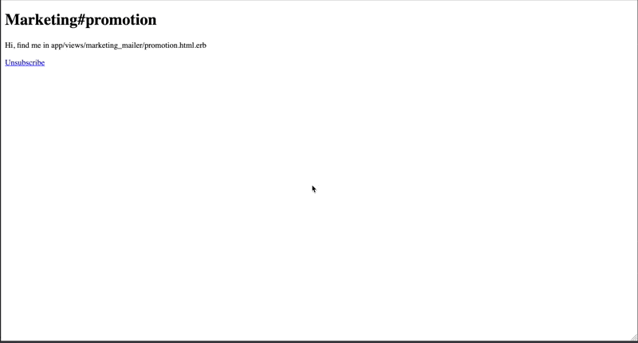

# Unsubscribe

Automatically unsubscribe from emails in Rails.



## Installation

Add this line to your application's Gemfile:

```ruby
gem 'unsubscribe'
```

And then execute:
```bash
$ bundle
```

Or install it yourself as:
```bash
$ gem install unsubscribe
```

Then run the installation commands:

```bash
rails g unsubscribe:install
rails unsubscribe:install:migrations
rails db:migrate
```

## Usage

### Unsubscribe::Owner

- Add `include Unsubscribe::Owner` to a `Model`. The `Model` must have an `email` column.

```ruby
class User < ApplicationRecord
  include Unsubscribe::Owner
end
```

#### Available Methods

```ruby
User.first.subscribed_to_mailer? "MarketingMailer"
# => true/false

User.first.to_sgid_for_mailer_subscription
# => #<SignedGlobalID:123 ...>
```

### Unsubscribe::Mailer

- Add `include Unsubscribe::Mailer` to a `Mailer`.
- Optionally call `unsubscribe_settings` to set a `name` and `description`. This will be used in the unsubscribe page.
- Set `mail to:` to `@recipient.email`. The `@recipient` is an instance of whatever Class `include Unsubscribe::Owner` was added to.

```ruby
class MarketingMailer < ApplicationMailer  
  include Unsubscribe::Mailer

  unsubscribe_settings name: "Marketing Emails", description: "Updates on promotions and sales."

  def promotion
    mail to: @recipient.email
  end  
end
```

- Call the `Mailer` with a `recipient` parameter.

```ruby
  MarketingMailer.with(
    recipient: User.first
  ).promotion.deliver_now
```

#### Available Methods

```ruby
Unsubscribe::MailerSubscription.first.action
# => "Unsubscribe from"/"Subscribe to"

Unsubscribe::MailerSubscription.first.call_to_action
# => "Unsubscribe from Marketing Emails"/"Subscribe to Marketing Emails"

Unsubscribe::MailerSubscription.first.description
# => "Updates on promotions and sales."

Unsubscribe::MailerSubscription.first.name
# => "Marketing Emails"
```

### Unsubscribe Link

- Add the `@unsubscribe_url` link to the `Mailer`.

```html+erb
<%= link_to "Unsubscribe", @unsubscribe_url %>
```

## Customize Templates

Run `rails g unsubscribe:views` if you want to modify the existing templates.

## I18n

The language used for `Unsubscribe::MailerSubscription#action` can be translated.

```yml
# config/locales/en.yml
en:
  unsubscribe:
    action:
      subscribe: "Subscribe to"
      unsubscribe: "Unsubscribe from"
```

## Contributing

If you'd like to open a PR please make sure the following things pass:

```ruby
bin/rails test
bundle exec standardrb
```

## License

The gem is available as open source under the terms of the [MIT License](https://opensource.org/licenses/MIT).
